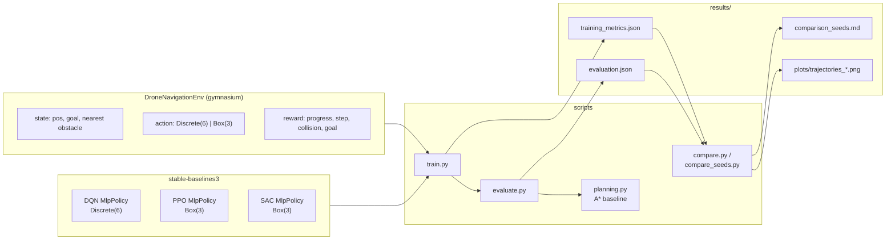
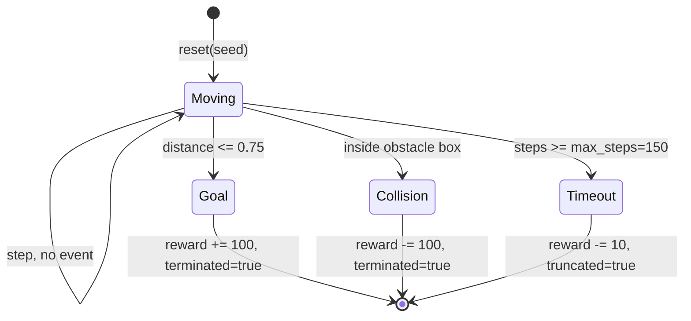

# INS - Drone Control in 3D Space (Assignment 16)

Comparison of three reinforcement learning algorithms (`DQN`, `PPO`, `SAC`) on a
3D point-drone navigation task with obstacles. The implementation uses
`stable-baselines3` and `gymnasium`.

---

## Authors and Contribution Split

- **Artem Davydenko** - artem.davydenko@student.tuke.sk
  - `DroneNavigationEnv`: position, goal, obstacles, reward, action spaces, and
    optional randomization:
    [src/drone_rl/envs/drone_navigation_env.py](src/drone_rl/envs/drone_navigation_env.py).
  - Training pipeline and hyperparameters:
    [src/drone_rl/train.py](src/drone_rl/train.py),
    [src/drone_rl/callbacks.py](src/drone_rl/callbacks.py).
  - A* baseline: [src/drone_rl/planning.py](src/drone_rl/planning.py).

- **Vladyslav Kalashnyk** - Vladyslav.kalashnyk@student.tuke.sk
  - Evaluation and metrics: [src/drone_rl/evaluate.py](src/drone_rl/evaluate.py).
  - Algorithm comparison, 3D plots, and seed aggregation:
    [src/drone_rl/compare.py](src/drone_rl/compare.py),
    [src/drone_rl/compare_seeds.py](src/drone_rl/compare_seeds.py),
    [src/drone_rl/run_experiment.py](src/drone_rl/run_experiment.py).
  - Report writing and result analysis in this README.

The split is approximate; both authors reviewed each other's work.

---

## Contents

1. [Task Definition](#1-task-definition)
2. [Project Architecture](#2-project-architecture)
3. [Environment](#3-environment)
4. [Experiment](#4-experiment)
5. [Results and Analysis](#5-results-and-analysis)
6. [How to Reproduce](#6-how-to-reproduce)
7. [Limitations](#7-limitations)

---

## 1. Task Definition

Assignment 16 asks to train an RL agent to control a drone in 3D space, reach a
predefined target without collisions, implement three algorithms (`DQN`, `PPO`,
`SAC`), and compare them by:

- average time to reach the target,
- number of collisions during training,
- comparison with an optimal trajectory.

This project implements a simplified 3D navigation environment in `gymnasium`
and uses it to compare the three required algorithms under the same scene,
metrics, and evaluation protocol.

---

## 2. Project Architecture



Source tree:

```text
src/drone_rl/
    envs/drone_navigation_env.py   # 3D environment, 9-D observation
    train.py                        # training CLI
    evaluate.py                     # evaluation CLI
    planning.py                     # A* + straight-line baseline
    callbacks.py                    # train-time collision counter
    compare.py                      # per-seed aggregation + 3D plots
    compare_seeds.py                # cross-seed mean +/- std
    run_experiment.py               # full 3 x N driver
scripts/
    retrain_and_eval.py             # parallel driver used for this README
    resume_experiment.py            # helper for resuming partial runs
    run_stochastic_eval.py          # stochastic evaluation helper
results/                            # metrics, tables, plots
models/                             # trained SB3 zip files
```

---

## 3. Environment

### 3.1. Geometry

- World: a `10 x 10 x 10` cube with coordinates in `[-5, 5]^3`.
- Obstacles: two deterministic axis-aligned boxes.
- Start: `[-4, -4, -4]`.
- Goal: `[4, 4, 4]`.
- Success threshold: `0.75`.
- Euclidean start-to-goal distance:
  $\sqrt{3} \cdot 8 \approx 13.86$.
- A* optimum on a 6-neighbour grid with step size 1:
  **24 steps, path length 24.0**.

### 3.2. Spaces

| Role | Shape | Description |
| --- | --- | --- |
| Observation | `Box(9,)` | `[pos/10, goal/10, (nearest_obstacle - pos)/10]` |
| DQN action | `Discrete(6)` | `+/-x`, `+/-y`, `+/-z` unit moves |
| PPO/SAC action | `Box(3,)`, $[-1, 1]^3$ | Clipped continuous motion vector |

### 3.3. Reward

$$
r_t = 5 \cdot \Delta d - 0.1 \;+\; \begin{cases} +100 & \text{goal reached (terminate)} \\ -100 & \text{collision (terminate)} \\ -10 & \text{timeout (truncate)} \\ 0 & \text{else} \end{cases}
$$

where $\Delta d$ is the decrease in distance to the goal during one step, and
`-0.1` is a step penalty that encourages shorter trajectories.

### 3.4. Episode State Diagram



---

## 4. Experiment

### 4.1. Protocol

- 3 algorithms x 3 seeds: `0`, `1`, `2`.
- `DQN` and `PPO`: 200,000 training steps.
- `SAC`: 30,000 training steps.
- Per-algorithm hyperparameters are defined in `ALGO_KWARGS` in
  [src/drone_rl/train.py](src/drone_rl/train.py).
- Evaluation uses 30 episodes in two modes:
  - **deterministic**: `policy.predict(..., deterministic=True)`;
  - **stochastic**: samples actions from the policy distribution.
- Training metrics are collected by `TrainingMetricsCallback` in
  [src/drone_rl/callbacks.py](src/drone_rl/callbacks.py) from
  `infos["collision"]`, `infos["reached_goal"]`, and `infos["timeout"]` at the
  end of each episode during `learn()`.

### 4.2. Pipeline


---

## 5. Results and Analysis

### 5.1. Training Metrics (seed 0)

| Algo | Episodes | Collisions | Successes | Timeouts | Collision rate |
| --- | ---: | ---: | ---: | ---: | ---: |
| DQN | 5614 | 3811 | 1265 | 538 | 0.679 |
| PPO | 4784 | 1849 | 2345 | 590 | 0.386 |
| SAC | 425 | 252 | 0 | 173 | 0.593 |

`PPO` is the strongest learner during training: roughly half of its completed
episodes are successful. `DQN` learns more slowly but still reaches the goal in
a meaningful fraction of episodes after 200k steps. `SAC` completes only 425
episodes in the 30k-step budget and does not learn a stable successful policy.

### 5.2. Deterministic Evaluation (30 episodes x 3 seeds, mean +/- std)

| Algorithm | Eval success | Eval collision | Eval timeout | Avg steps (succ.) | Path / A* | Avg reward |
| --- | ---: | ---: | ---: | ---: | ---: | ---: |
| DQN | **0.667 +/- 0.577** | 0.333 +/- 0.577 | 0.000 +/- 0.000 | 25.0 +/- 1.4 | 1.042 +/- 0.059 | 86.7 +/- 138.8 |
| PPO | **0.667 +/- 0.577** | 0.000 +/- 0.000 | 0.333 +/- 0.577 | 15.0 +/- 0.0 | **0.621 +/- 0.005** | 118.3 +/- 82.2 |
| SAC | 0.000 +/- 0.000 | 0.000 +/- 0.000 | 1.000 +/- 0.000 | - | - | -7.9 +/- 5.0 |

Data source: [results/comparison_seeds.md](results/comparison_seeds.md).

The `Path / A*` value for `PPO` is below 1 because the A* baseline is computed
on a 6-neighbour unit grid, while `PPO` uses continuous 3D actions. Therefore,
`PPO` can move diagonally and produce a shorter Euclidean trajectory than the
discrete grid optimum. `DQN` uses the same discrete move set as A*, so its
`Path / A* = 1.04` means it is close to optimal under the discrete action model.

### 5.3. Stochastic Evaluation (30 episodes x 3 seeds)

| Algorithm | Eval success | Eval collision | Eval timeout | Avg steps (succ.) | Path / A* |
| --- | ---: | ---: | ---: | ---: | ---: |
| DQN | 0.589 +/- 0.517 | 0.400 +/- 0.498 | 0.011 +/- 0.019 | 26.7 +/- 2.5 | 1.114 +/- 0.103 |
| PPO | 0.633 +/- 0.549 | 0.056 +/- 0.019 | 0.311 +/- 0.539 | 18.2 +/- 1.2 | 0.749 +/- 0.048 |
| SAC | 0.000 +/- 0.000 | 0.000 +/- 0.000 | 1.000 +/- 0.000 | - | - |

Data source:
[results/comparison_seeds_stochastic.md](results/comparison_seeds_stochastic.md).

The stochastic mode slightly reduces `PPO` and `DQN` accuracy because the agent
occasionally samples risky actions. For `DQN`, stochastic evaluation also avoids
some deterministic cycles, so its timeout rate falls to approximately 1%.

### 5.4. Success Rate by Seed

```mermaid
xychart-beta
    title "Eval success rate per seed (deterministic)"
    x-axis ["seed_0", "seed_1", "seed_2"]
    y-axis "success rate" 0 --> 1
    bar [1.0, 1.0, 0.0]
    bar [1.0, 1.0, 0.0]
    bar [0.0, 0.0, 0.0]
```



Bar order: `DQN`, `PPO`, `SAC`.

- `DQN` and `PPO` solve the task on `seed_0` and `seed_1`, but both fail on
  `seed_2`.
- `SAC` does not converge on any seed under the selected training budget.

### 5.5. 3D Trajectories (seed 0, deterministic policy)

| DQN | PPO | SAC |
| --- | --- | --- |
|  |  |  |

The green line is the A* optimum, and the blue lines are agent trajectories.
`DQN` moves on the grid, `PPO` uses continuous diagonal-like moves, and `SAC`
mostly times out without reaching the target.

### 5.6. Assignment Requirements

| Requirement | Metric | Location |
| --- | --- | --- |
| Average time to target | `Avg steps (success)` | Sections 5.2 and 5.3 |
| Training collisions | `Collisions`, `collision_rate` | Section 5.1 and `results/seed_*/<algo>_training_metrics.json` |
| Comparison with optimum | `Path / A*`, `optimal_astar_path_length` | Sections 5.2 and 5.3, [src/drone_rl/planning.py](src/drone_rl/planning.py) |
| DQN vs PPO vs SAC | Summary tables and plots | Sections 5.2-5.5 |

### 5.7. Conclusion

- **PPO** is the best algorithm for this task under the selected budget: it has
  a high success rate, no deterministic evaluation collisions, and a trajectory
  close to the Euclidean lower bound.
- **DQN** also solves the task, but its grid-based action space makes the path
  longer.
- **SAC** needs substantially more training steps; with 30k steps it does not
  stabilize and mostly reaches the timeout.
- The high standard deviation is caused by the small number of seeds and the
  binary nature of success/failure on a fixed scene. More seeds and optional
  environment randomization would produce more stable statistics.

---

## 6. How to Reproduce

### 6.1. Environment Setup

```powershell
python -m venv .venv
.\.venv\Scripts\Activate.ps1
pip install -r requirements.txt
$env:PYTHONPATH = "src"
```

If PowerShell blocks activation scripts:

```powershell
Set-ExecutionPolicy -Scope Process Bypass
.\.venv\Scripts\Activate.ps1
```

### 6.2. Full Experiment

```powershell
python scripts/retrain_and_eval.py
```

The script runs 9 training jobs, 9 deterministic evaluation jobs, 9 stochastic
evaluation jobs, then generates comparison tables and plots.

Configurable alternative:

```powershell
python -m drone_rl.run_experiment --timesteps 200000 --sac-timesteps 30000 `
    --seeds 0 1 2 --episodes 30 --parallel 9 --threads-per-worker 1 --clean
```

### 6.3. Individual Steps

Train one algorithm:

```powershell
python -m drone_rl.train --algo ppo --timesteps 200000 --seed 0
```

Evaluate one algorithm:

```powershell
python -m drone_rl.evaluate --algo ppo --episodes 30 --seed 1000
python -m drone_rl.evaluate --algo ppo --episodes 30 --seed 2000 --stochastic
```

Compare one seed and generate 3D plots:

```powershell
python -m drone_rl.compare --results-dir results/seed_0
```

Aggregate across seeds:

```powershell
python -m drone_rl.compare_seeds --results-dir results
python -m drone_rl.compare_seeds --results-dir results --suffix _stochastic
```

### 6.4. Optional Randomization

Start and goal positions can be randomized while obstacles remain fixed:

```powershell
python -m drone_rl.train --algo ppo --timesteps 200000 --seed 0 --randomize
python -m drone_rl.evaluate --algo ppo --episodes 30 --seed 1000 --randomize
```

With randomization enabled, `Path / A*` is no longer directly comparable with
the fixed-scene results because the A* length is recomputed for each sampled
start-goal pair inside `evaluate.py`.

### 6.5. Outputs

Trained models:

```text
models/
```

Evaluation and comparison results:

```text
results/
```

---

## 7. Limitations

1. The reported scene is deterministic: start, goal, and obstacles are fixed.
   Optional randomization is available through `--randomize`.
2. Drone dynamics are not modeled. The environment uses point kinematics with
   step length up to 1.
3. The observation includes only the nearest obstacle; with more obstacles, the
   agent would not observe all of them directly.
4. Three seeds are a minimal statistical sample. More reliable reporting would
   use at least 5-10 seeds.
5. `SAC` is undertrained at 30k steps. A more complete comparison would train it
   for a larger budget, but this would significantly increase CPU runtime.
