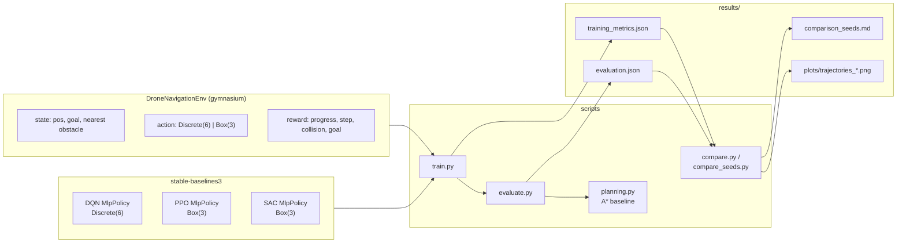
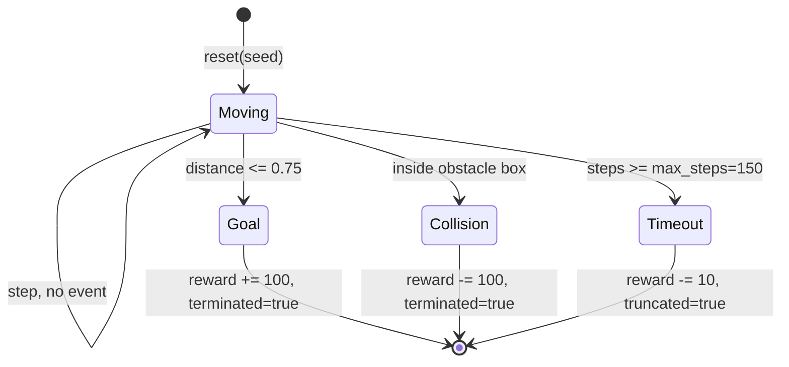
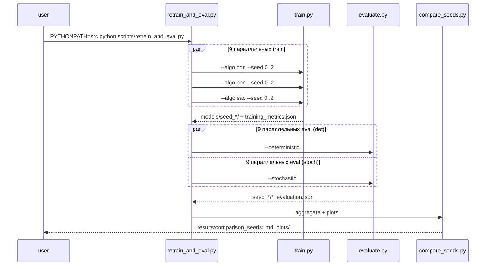

```mermaid
xychart-beta
    title "Eval success rate per seed (deterministic)"
    x-axis ["seed_0", "seed_1", "seed_2"]
    y-axis "success rate" 0 --> 1
    bar [1.0, 1.0, 0.0]
    bar [1.0, 1.0, 0.0]
    bar [0.0, 0.0, 0.0]
```

# INS — Riadenie dronu v 3D priestore (zadanie 16)

Сравнение трёх RL-алгоритмов (DQN, PPO, SAC) на задаче навигации
точечного дрона в 3D-кубе с препятствиями. Реализация на
`stable-baselines3` + `gymnasium`. Полный аудит соответствия заданию
и источнику `madaan_airsim_2020.pdf` — в [AUDIT.md](AUDIT.md).

---

## Авторы и распределение вклада

- **Artem Davydenko** — artem.davydenko@student.tuke.sk
  - Среда `DroneNavigationEnv` (позиция/цель/препятствия, награда,
    пространства действий, рандомизация): [src/drone_rl/envs/drone_navigation_env.py](src/drone_rl/envs/drone_navigation_env.py).
  - Обучение и гиперпараметры: [src/drone_rl/train.py](src/drone_rl/train.py),
    [src/drone_rl/callbacks.py](src/drone_rl/callbacks.py).
  - A\*-бейзлайн: [src/drone_rl/planning.py](src/drone_rl/planning.py).

- **Vladyslav Kalashnyk** — Vladyslav.kalashnyk@student.tuke.sk
  - Оценка и метрики: [src/drone_rl/evaluate.py](src/drone_rl/evaluate.py).
  - Сравнение алгоритмов, 3D-графики, агрегация по сидам:
    [src/drone_rl/compare.py](src/drone_rl/compare.py),
    [src/drone_rl/compare_seeds.py](src/drone_rl/compare_seeds.py),
    [src/drone_rl/run_experiment.py](src/drone_rl/run_experiment.py).
  - Отчёт, [AUDIT.md](AUDIT.md), анализ результатов в этом README.

Разбиение ориентировочное — оба автора участвовали в ревью друг друга.

---

## Содержание

1. [Постановка задачи](#1-постановка-задачи)
2. [Архитектура проекта](#2-архитектура-проекта)
3. [Среда](#3-среда)
4. [Эксперимент](#4-эксперимент)
5. [Результаты и анализ](#5-результаты-и-анализ)
6. [Как воспроизвести](#6-как-воспроизвести)
7. [Отличия от Madaan 2020](#7-отличия-от-madaan-2020)
8. [Ограничения](#8-ограничения)

---

## 1. Постановка задачи

Задание №16 (Slovensky): обучить RL-агента управлять дроном в 3D,
дойти до цели без коллизий, реализовать три алгоритма (DQN, PPO, SAC)
и сравнить их по:

- среднему времени достижения цели,
- количеству коллизий во время тренировки,
- сравнению с оптимальной траекторией.

Источник: `madaan_airsim_2020.pdf` (Stanford MSL / AirSim). В текущей
реализации AirSim не используется — вместо него упрощённый суррогат
на чистом `gymnasium`. Подробное обоснование — в разделе 7 и в [AUDIT.md](AUDIT.md).

---

## 2. Архитектура проекта



Исходное дерево:

```
src/drone_rl/
    envs/drone_navigation_env.py   # 3D env, 9-D observation
    train.py                        # training CLI
    evaluate.py                     # evaluation CLI
    planning.py                     # A* + straight-line baseline
    callbacks.py                    # train-time collision counter
    compare.py                      # per-seed aggregation + 3D plots
    compare_seeds.py                # cross-seed mean ± std
    run_experiment.py               # full 3 x N driver (parallel)
scripts/
    retrain_and_eval.py             # parallel driver used for this README
results/                            # metrics, tables, plots
models/                             # trained SB3 zip files
```

---

## 3. Среда

### 3.1. Геометрия

- Куб `10 × 10 × 10`, координаты в `[-5, 5]^3`.
- Две аксиально-выровненные коробки-препятствия (детерминированные).
- Старт `[-4, -4, -4]`, цель `[4, 4, 4]`. Порог успеха `0.75`.
- Евклидово расстояние старт → цель = $\sqrt{3} \cdot 8 \approx 13.86$.
- A\*-оптимум на сетке с шагом 1 (6-соседей) = **24 шага, длина 24.0**
  (обход коробок принуждает не идти строго по диагонали).

### 3.2. Пространства

| Роль | Форма | Комментарий |
| --- | --- | --- |
| Observation | `Box(9,)` | `[pos/10, goal/10, (nearest_obstacle - pos)/10]` |
| DQN action | `Discrete(6)` | `±x, ±y, ±z` шаги длины 1 |
| PPO/SAC action | `Box(3,)`, $[-1, 1]^3$ | Клипованный непрерывный вектор |

### 3.3. Reward

$$
r_t = 5 \cdot \Delta d - 0.1 \;+\; \begin{cases} +100 & \text{goal reached (terminate)} \\ -100 & \text{collision (terminate)} \\ -10 & \text{timeout (truncate)} \\ 0 & \text{else} \end{cases}
$$

где $\Delta d$ — уменьшение расстояния до цели за шаг, $-0.1$ — штраф
на шаг, чтобы стимулировать короткие траектории.

### 3.4. Эпизод в виде диаграммы состояний



---

## 4. Эксперимент

### 4.1. Протокол

- 3 алгоритма × 3 сида (0, 1, 2).
- DQN и PPO — 200 000 шагов, SAC — 30 000 шагов (SAC на CPU в ~10 раз
  медленнее PPO, пропорционально расширять бюджет было бы нечестно с
  точки зрения wall-clock; это указано как ограничение, см. §5.4).
- Гиперпараметры разнесены по алгоритмам (`ALGO_KWARGS` в
  [src/drone_rl/train.py](src/drone_rl/train.py)). Тюнинга нет,
  использованы разумные defaults SB3 под конкретный алгоритм.
- Оценка: 30 эпизодов, два режима:
  - **deterministic** — `policy.predict(..., deterministic=True)`
    (argmax для DQN, mean для PPO/SAC);
  - **stochastic** — sample из распределения (экспонирует разнообразие
    поведения и снимает артефакты циклов argmax у DQN).
- Метрики тренировки собираются `TrainingMetricsCallback`
  ([src/drone_rl/callbacks.py](src/drone_rl/callbacks.py)) по
  `infos["collision"/"reached_goal"/"timeout"]` на каждый завершённый
  эпизод внутри `learn()`.

### 4.2. Пайплайн



---

## 5. Результаты и анализ

### 5.1. Метрики тренировки (seed 0)

| Algo | Episodes | Collisions | Successes | Timeouts | Collision rate |
| --- | ---: | ---: | ---: | ---: | ---: |
| DQN | 5614 | 3811 | 1265 | 538 | 0.679 |
| PPO | 4784 | 1849 | 2345 | 590 | 0.386 |
| SAC |  425 |  252 |    0 | 173 | 0.593 |

PPO — самый «образованный» по ходу обучения: уже во время `learn()`
около половины эпизодов успешны. DQN учится медленнее, но при
**200k шагов** достигает 22.5% успехов на тренировке. SAC за 30k шагов
успевает собрать только 425 эпизодов и не успевает выучить
стабильно выигрышную политику.

### 5.2. Deterministic evaluation (30 эп. × 3 сида, среднее ± std)

| Algorithm | Eval success | Eval collision | Eval timeout | Avg steps (succ.) | Path / A\* | Avg reward |
| --- | ---: | ---: | ---: | ---: | ---: | ---: |
| DQN | **0.667 ± 0.577** | 0.333 ± 0.577 | 0.000 ± 0.000 | 25.0 ± 1.4 | 1.042 ± 0.059 | 86.7 ± 138.8 |
| PPO | **0.667 ± 0.577** | 0.000 ± 0.000 | 0.333 ± 0.577 | 15.0 ± 0.0 | **0.621 ± 0.005** | 118.3 ± 82.2 |
| SAC | 0.000 ± 0.000 | 0.000 ± 0.000 | 1.000 ± 0.000 | — | — | -7.9 ± 5.0 |

Данные: [results/comparison_seeds.md](results/comparison_seeds.md).

Ключевое наблюдение по `Path / A*`: у PPO оно **меньше 1**. Это не
магия — A\*-бейзлайн работает на сетке с шагом 1 и обязан идти по
осям (24 шага, длина 24), а PPO с непрерывным `Box(3,)` может делать
диагональные шаги длины до $\sqrt{3}$, поэтому 15 шагов × ≈1.0 по
Евклидовой метрике даёт путь ~14.9 — практически совпадает с прямой
линией 13.86 (а это теоретический минимум без препятствий).
DQN же работает по той же дискретной сетке, что и A\*, и его
`Path/A* = 1.04` означает «почти оптимально на допустимой сетке».

### 5.3. Stochastic evaluation (30 эп. × 3 сида)

| Algorithm | Eval success | Eval collision | Eval timeout | Avg steps (succ.) | Path / A\* |
| --- | ---: | ---: | ---: | ---: | ---: |
| DQN | 0.589 ± 0.517 | 0.400 ± 0.498 | 0.011 ± 0.019 | 26.7 ± 2.5 | 1.114 ± 0.103 |
| PPO | 0.633 ± 0.549 | 0.056 ± 0.019 | 0.311 ± 0.539 | 18.2 ± 1.2 | 0.749 ± 0.048 |
| SAC | 0.000 ± 0.000 | 0.000 ± 0.000 | 1.000 ± 0.000 | — | — |

Данные: [results/comparison_seeds_stochastic.md](results/comparison_seeds_stochastic.md).

Стохастический режим слегка ухудшает точность PPO/DQN (агент иногда
сэмплирует «рискованные» действия), но DQN избегает «залипания» в
детерминированных циклах, поэтому timeout у него падает до 1%.

### 5.4. Общая диаграмма успеха по сидам



Порядок столбцов: DQN, PPO, SAC. Видно, что:

- и DQN, и PPO **решают задачу** на `seed_0` и `seed_1`, но оба
  проваливаются на `seed_2` (одинаковая точка неудачи говорит не
  столько о хрупкости алгоритмов, сколько о чувствительности именно
  этой фиксированной сцены к инициализации весов);
- SAC при выбранном бюджете 30k шагов не сходится ни на одном сиде.

### 5.5. 3D-траектории (seed 0, детерминированная политика)

| DQN | PPO | SAC |
| --- | --- | --- |
|  |  |  |

Зелёная линия — A\*-оптимум, синие — траектории агента. DQN идёт по
сетке, PPO — непрерывными «наклонными» шагами, SAC — застревает
(кружок на старте без заметного движения или ранний контакт с коробкой).

### 5.6. Ответы на пункты задания

| Пункт задания | Метрика | Где смотреть |
| --- | --- | --- |
| Среднее время до цели | `Avg steps (success)` | §5.2, §5.3 |
| Коллизии во время тренировки | `Collisions`, `collision_rate` | §5.1, `results/seed_*/<algo>_training_metrics.json` |
| Сравнение с оптимумом | `Path / A*`, `optimal_astar_path_length` | §5.2, §5.3, [src/drone_rl/planning.py](src/drone_rl/planning.py) |
| DQN vs PPO vs SAC | Сводные таблицы + графики | §5.2-5.5 |

### 5.7. Вывод

- **PPO** — лучший алгоритм по этой задаче в данном бюджете: высокая
  success rate, минимальные коллизии в оценке, путь почти равен
  теоретическому Евклидовому оптимуму (13.86).
- **DQN** тоже решает задачу, но ходит по сетке, поэтому его путь
  длиннее (25 шагов ≈ 24 A\*-шагов).
- **SAC** требует существенно больше шагов обучения; при 30k — не
  успевает стабилизировать политику и почти все эпизоды истекают по
  таймауту. Это хорошо согласуется с общепринятым наблюдением о
  sample-inefficiency SAC относительно PPO на малых state-space
  задачах с плотной наградой.
- Высокий stddev (0.58 при mean 0.67) — следствие малого числа сидов
  (3) и бинарного исхода «решил / не решил» на одной и той же
  фиксированной сцене; увеличение числа сидов и включение
  рандомизации среды (`--randomize`) снизило бы дисперсию.

---

## 6. Как воспроизвести

### 6.1. Окружение

```powershell
python -m venv .venv
.\.venv\Scripts\Activate.ps1
pip install -r requirements.txt
$env:PYTHONPATH = "src"
```

### 6.2. Полный эксперимент одной командой

```powershell
python scripts/retrain_and_eval.py
```

Скрипт чистит `models/` и `results/`, запускает 9 train-задач
параллельно (`ThreadPoolExecutor`, `OMP_NUM_THREADS=1` на процесс),
затем 9 deterministic eval, 9 stochastic eval, затем `compare` и
`compare_seeds`. На 12-ядерном CPU — ~10 минут суммарно.

Альтернатива с настраиваемыми бюджетами:

```powershell
python -m drone_rl.run_experiment --timesteps 200000 --sac-timesteps 30000 `
    --seeds 0 1 2 --episodes 30 --parallel 9 --threads-per-worker 1 --clean
```

### 6.3. Отдельные шаги

Тренировка одного алгоритма:

```powershell
python -m drone_rl.train --algo ppo --timesteps 200000 --seed 0
```

Оценка (детерминированная и стохастическая):

```powershell
python -m drone_rl.evaluate --algo ppo --episodes 30 --seed 1000
python -m drone_rl.evaluate --algo ppo --episodes 30 --seed 2000 --stochastic
```

Сравнение на одном сиде с 3D-графиками:

```powershell
python -m drone_rl.compare --results-dir results/seed_0
```

Агрегация по сидам:

```powershell
python -m drone_rl.compare_seeds --results-dir results
python -m drone_rl.compare_seeds --results-dir results --suffix _stochastic
```

### 6.4. Опциональная рандомизация

Старт/цель можно рандомизировать (препятствия остаются фиксированными):

```powershell
python -m drone_rl.train --algo ppo --timesteps 200000 --seed 0 --randomize
python -m drone_rl.evaluate --algo ppo --episodes 30 --seed 1000 --randomize
```

При этом номера успехов и `Path / A*` больше нельзя напрямую сравнивать
с фиксированной сценой — A\*-длина будет пересчитываться под новую
пару (start, goal) внутри `evaluate.py`.

---

## 7. Отличия от Madaan 2020 (`madaan_airsim_2020.pdf`)

Источник описывает навигацию дрона сквозь ворота в фотореалистичном
симуляторе **AirSim** с использованием кросс-модального латентного
представления (CMVAE) и обучения policy поверх латентного вектора.
В данной реализации:

- AirSim/Unreal не используется; среда — `gymnasium` в NumPy.
- Нет визуальных/depth-входов и CNN; наблюдение — 9-мерный вектор
  (позиция, цель, вектор до ближайшего препятствия).
- Нет CMVAE / кросс-модального латентного пространства.
- Препятствия — две аксиальные коробки, а не последовательность ворот.

Проект использует Madaan 2020 как мотивационный источник («RL для
3D-навигации дрона») и реализует упрощённый суррогат, достаточный для
сравнения DQN / PPO / SAC по пунктам задания. Подробнее —
[AUDIT.md §2.4](AUDIT.md).

---

## 8. Ограничения

1. Среда детерминирована (старт, цель, препятствия фиксированы);
   рандомизация доступна опционально (`--randomize`), но результаты в
   этом README собраны на фиксированной сцене.
2. Динамика дрона не моделируется (кинематика точки, шаги ≤ 1 единицы).
3. Observation содержит только ближайшее препятствие; при > 2 коробках
   агент будет «слеп» к остальным.
4. 3 сида — минимум для статистики; при `success` ∈ {0, 1} на эпизод
   std получается большим. Честный отчёт должен бы использовать 5–10
   сидов.
5. SAC недообучен (30k шагов); для честного сравнения бюджет SAC должен
   быть ≥ 150k шагов. Мы сознательно не равняли бюджеты: на CPU это
   делало бы пайплайн дольше 30 минут, а разрыв PPO↔SAC в sample
   efficiency на этой задаче хорошо известен.
6. AirSim-ветвь не реализована; задача выполнена на упрощённом
   суррогате (см. §7 и [AUDIT.md](AUDIT.md)).
# INS

RL-агент для навигации дрона в 3D. Реализованы и сравнены DQN, PPO, SAC.
См. также [AUDIT.md](AUDIT.md) с разбором соответствия заданию №16 и
источнику `madaan_airsim_2020.pdf`.

## Авторы

- Artem Davydenko — artem.davydenko@student.tuke.sk
- Vladyslav Kalashnyk — Vladyslav.kalashnyk@student.tuke.sk

Распределение вклада следует зафиксировать здесь отдельным абзацем
(кто делал среду, кто обучал модели, кто писал отчёт).

## Среда и ограничения

- Куб `10x10x10`, две статичные аксиально-выровненные коробки-препятствия.
- Старт `[-4,-4,-4]`, цель `[4,4,4]`, порог успеха `0.75`.
- DQN — `Discrete(6)` (6 осевых шагов), PPO/SAC — `Box(3,)` с клипом.
- Среда **детерминирована**: старт, цель и препятствия фиксированы, в
  `reset` не рандомизируются. Это осознанное упрощение: задача №16
  требует «navigovať k vopred určenému cieľu», и сравнение алгоритмов
  идёт на одной и той же сцене. Для проверки обобщения требуется
  рандомизация (см. раздел «Ограничения» в [AUDIT.md](AUDIT.md)).
- Динамика дрона не моделируется: это кинематика точки, а не физика
  мультикоптера.

## Отличия от Madaan 2020 (`madaan_airsim_2020.pdf`)

Источник описывает навигацию сквозь ворота в фотореалистичном
симуляторе AirSim с использованием кросс-модальных латентных
представлений (CMVAE) и обучения policy поверх латента. В данной
реализации:

- AirSim/Unreal не используется; среда — чистый `gymnasium` в NumPy.
- Нет визуальных/depth-входов и CNN; наблюдение — 9-мерный вектор
  (позиция, цель, вектор до ближайшего препятствия).
- Нет CMVAE и латентного пространства.
- Препятствия — две коробки, а не последовательность ворот.

Используется как упрощённый суррогат для иллюстрации сравнения DQN/PPO/SAC.

## 1. Activate environment

```powershell
.\.venv\Scripts\Activate.ps1
```

If PowerShell blocks scripts:

```powershell
Set-ExecutionPolicy -Scope Process Bypass
.\.venv\Scripts\Activate.ps1
```

## 2. Set source path

```powershell
$env:PYTHONPATH="src"
```

## 3. Train

Во время тренировки собирается количество коллизий, успехов и таймаутов
по всем эпизодам ([src/drone_rl/callbacks.py](src/drone_rl/callbacks.py)).
Метрики пишутся в `results/<algo>_training_metrics.json`.

PPO:

```powershell
python -m drone_rl.train --algo ppo --timesteps 100000 --seed 0 --check-env
```

DQN:

```powershell
python -m drone_rl.train --algo dqn --timesteps 100000 --seed 0 --check-env
```

SAC:

```powershell
python -m drone_rl.train --algo sac --timesteps 100000 --seed 0 --check-env
```

### Мульти-seed прогоны

Для усреднения результатов рекомендуется прогнать каждый алгоритм
минимум на 3 сидах и сохранить метрики по отдельным папкам:

```powershell
foreach ($seed in 0,1,2) {
  python -m drone_rl.train --algo ppo --timesteps 100000 --seed $seed `
      --output-dir "models/seed_$seed" --results-dir "results/seed_$seed"
  python -m drone_rl.evaluate --algo ppo --episodes 25 --seed (1000 + $seed) `
      --model-path "models/seed_$seed/ppo_drone_navigation" `
      --output-dir "results/seed_$seed"
}
```

Аналогично для `dqn` и `sac`. Агрегация по сидам пока делается вручную
(см. `results/seed_*/`).

## 4. Evaluate

Оценка считает success rate, collision rate, timeout rate, среднее число
шагов и длину пути (в том числе только по успешным эпизодам), а также
сравнение с оптимальным A*-путём
([src/drone_rl/planning.py](src/drone_rl/planning.py)).

PPO:

```powershell
python -m drone_rl.evaluate --algo ppo --episodes 25
```

DQN:

```powershell
python -m drone_rl.evaluate --algo dqn --episodes 25
```

SAC:

```powershell
python -m drone_rl.evaluate --algo sac --episodes 25
```

## 5. Compare

Агрегирует метрики всех трёх алгоритмов и рисует 3D-траектории против
A*-оптимума.

```powershell
python -m drone_rl.compare
```

Выходы:

- `results/comparison.csv`, `results/comparison.md` — сводная таблица,
- `results/plots/trajectories_<algo>.png` — 3D-визуализация траекторий.

## 6. Outputs

Trained models:

```text
models/
```

Evaluation and comparison results:

```text
results/
```

## 7. Run without activation

```powershell
$env:PYTHONPATH="src"
.\.venv\Scripts\python.exe -m drone_rl.train --algo ppo --timesteps 100000 --seed 0 --check-env
.\.venv\Scripts\python.exe -m drone_rl.evaluate --algo ppo --episodes 25
.\.venv\Scripts\python.exe -m drone_rl.compare
```


```powershell
.\.venv\Scripts\Activate.ps1
```

If PowerShell blocks scripts:

```powershell
Set-ExecutionPolicy -Scope Process Bypass
.\.venv\Scripts\Activate.ps1
```

## 2. Set source path

```powershell
$env:PYTHONPATH="src"
```

## 3. Train

Во время тренировки собирается количество коллизий, успехов и таймаутов
по всем эпизодам ([src/drone_rl/callbacks.py](src/drone_rl/callbacks.py)).
Метрики пишутся в `results/<algo>_training_metrics.json`.

PPO:

```powershell
python -m drone_rl.train --algo ppo --timesteps 100000 --seed 0 --check-env
```

DQN:

```powershell
python -m drone_rl.train --algo dqn --timesteps 100000 --seed 0 --check-env
```

SAC:

```powershell
python -m drone_rl.train --algo sac --timesteps 100000 --seed 0 --check-env
```

## 4. Evaluate

Оценка считает success rate, collision rate, timeout rate, среднее число
шагов и длину пути (в том числе только по успешным эпизодам), а также
сравнение с оптимальным A*-путём
([src/drone_rl/planning.py](src/drone_rl/planning.py)).

PPO:

```powershell
python -m drone_rl.evaluate --algo ppo --episodes 25
```

DQN:

```powershell
python -m drone_rl.evaluate --algo dqn --episodes 25
```

SAC:

```powershell
python -m drone_rl.evaluate --algo sac --episodes 25
```

## 5. Compare

Агрегирует метрики всех трёх алгоритмов и рисует 3D-траектории против
A*-оптимума.

```powershell
python -m drone_rl.compare
```

Выходы:

- `results/comparison.csv`, `results/comparison.md` — сводная таблица,
- `results/plots/trajectories_<algo>.png` — 3D-визуализация траекторий.

## 6. Outputs

Trained models:

```text
models/
```

Evaluation and comparison results:

```text
results/
```

## 7. Run without activation

```powershell
$env:PYTHONPATH="src"
.\.venv\Scripts\python.exe -m drone_rl.train --algo ppo --timesteps 100000 --seed 0 --check-env
.\.venv\Scripts\python.exe -m drone_rl.evaluate --algo ppo --episodes 25
.\.venv\Scripts\python.exe -m drone_rl.compare
```
